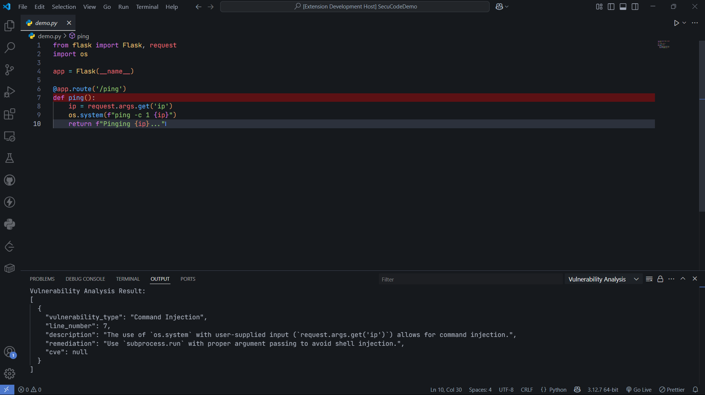
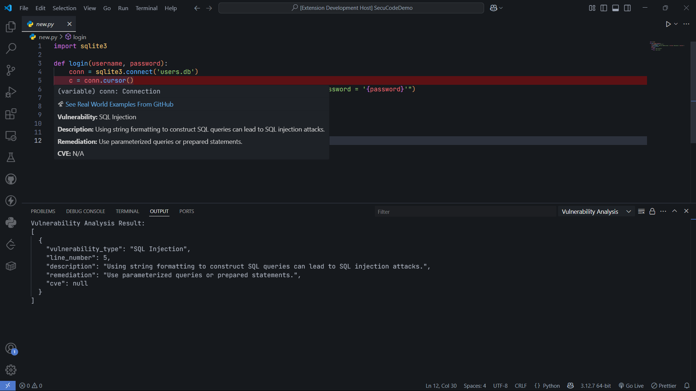
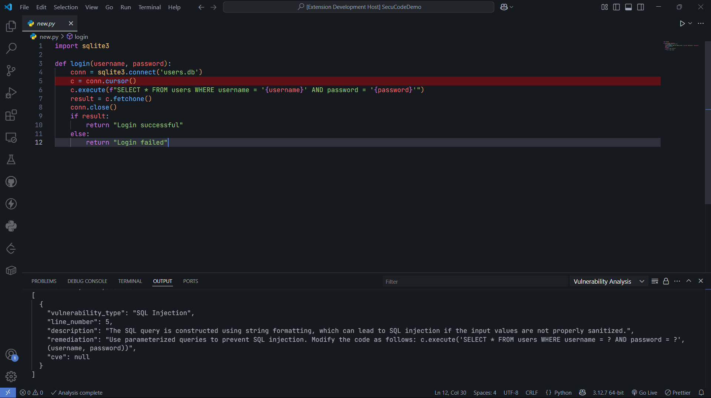
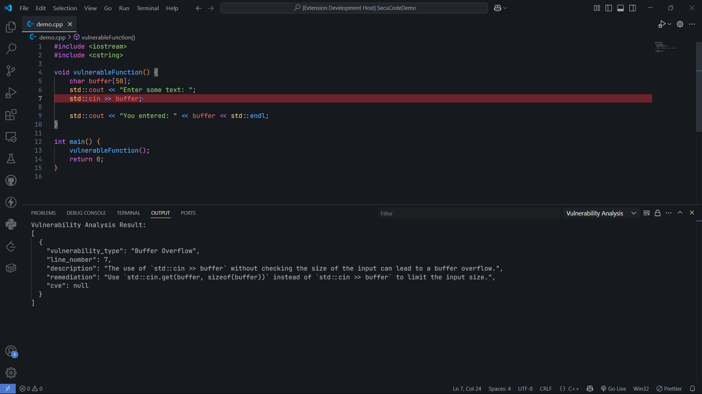

# SecuCode AI 🔐
> AI-Powered Code Security Auditor – VS Code Extension

## 📌 Overview

**SecuCode AI** is an AI-powered security auditing extension for **Visual Studio Code**, designed to detect vulnerabilities like SQL Injection, Cross-Site Scripting (XSS), and hardcoded secrets **in real time** as you write code.

This extension is **not published to the VS Code Marketplace**. However, you can test it easily by launching it in **Extension Development Host mode** within VS Code.

---

## 🚀 How to Use (For Testing)

1. Clone the project and install dependencies in both frontend and backend.
2. Start the backend server to enable AI-based code analysis.
3. Open the `frontend` folder in VS Code.
4. Press `F5` or click **Run → Start Debugging** to launch the **Extension Development Host**.
5. Begin writing code — vulnerabilities will be detected and suggestions displayed inline.

---

## ⚙️ Tech Stack

| Layer         | Technology                            |
|---------------|----------------------------------------|
| **Frontend**  | TypeScript (VS Code Extension API)     |
| **Backend**   | Node.js + Express.js + axios           |
| **AI Engine** | OLLaMA Model (via backend)             |
| **IDE**       | Visual Studio Code (Extension Host)    |

---

## 🖼️ Screenshots

### 🔍 Real-time Detection in VS Code

### 🛠️ Fix Suggestion Popup

### ⚠️ SQL Injection Detection or Warning

### ⚠️ Buffer Overflow Warning

